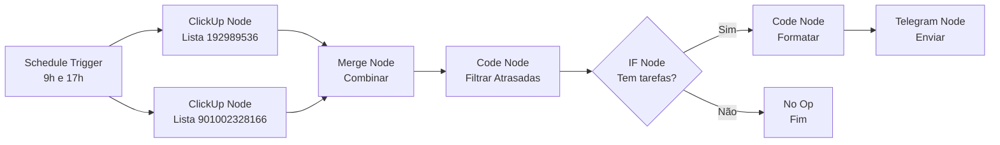

# 📁 Workflows n8n - Automações ClickUp

Este diretório contém workflows n8n prontos para importar e usar.

---

## 📋 Workflows Disponíveis

### 🚨 ClickUp - Alertas de Tarefas Atrasadas

**Arquivo**: `clickup-alertas-n8n.json`

**Descrição**: Monitora automaticamente suas listas do ClickUp e envia alertas no Telegram quando tarefas estão atrasadas há mais de 7 dias.

**Frequência**: 2x por dia (9h e 17h)

**Custo**: Gratuito (n8n Cloud free tier)

**Como usar**:
1. Importe o arquivo no n8n Cloud
2. Configure credenciais (ClickUp API Token + Telegram Bot Token)
3. Ative o workflow

Veja o guia completo em: [`../N8N-SETUP.md`](../N8N-SETUP.md)

---

## 🧪 Testes

### `test-n8n-logic.js`

Script Node.js para validar a lógica dos Code Nodes do workflow localmente antes de importar.

**Como executar**:

```bash
node workflows/test-n8n-logic.js
```

**O que testa**:
- ✅ Filtro de tarefas atrasadas (tag + status + due_date)
- ✅ Formatação da mensagem Telegram
- ✅ Validação de todos os critérios de alerta
- ✅ Casos edge (sem responsável, sem due_date, etc.)

**Resultado esperado**:

```
🧪 TESTANDO: Code Node - Filtrar Tarefas Atrasadas
═══════════════════════════════════════════════════
📊 Total de tarefas processadas: 8
✅ Tarefas atrasadas encontradas: 4

🔍 VALIDAÇÕES:
✅ PASSOU: Encontrou 4 tarefas atrasadas (esperado)
✅ PASSOU: Todas têm a tag "semana anterior"
✅ PASSOU: Todas têm status válidos
✅ PASSOU: Todas têm > 7 dias de atraso

🎉 Todos os testes passaram! O workflow está pronto para uso.
```

---

## 🎨 Estrutura do Workflow



---

## 🔧 Personalização

### Alterar Horários

No **Schedule Trigger node**:

```javascript
// Manhã (9h)
0 9 * * *

// Tarde (17h)
0 17 * * *

// Outras opções:
0 12 * * *  // Meio-dia
0 0 * * *   // Meia-noite
0 8,12,18 * * *  // 8h, 12h e 18h
```

Use https://crontab.guru para ajudar com cron expressions.

### Alterar Threshold de Dias

No **Code Node: Filtrar Atrasadas**, linha 7:

```javascript
const DAYS_THRESHOLD = 7;  // Altere para 10, 14, etc.
```

### Adicionar Mais Status

No **Code Node: Filtrar Atrasadas**, linhas 1-4:

```javascript
const STATUSES_ALERTAR = [
  'STAND BY', 
  'PENDENTE', 
  'PRONTO PARA FAZER',
  'EM PROGRESSO', 
  'EM VALIDAÇÃO', 
  'EM ALTERAÇÃO',
  'SEU NOVO STATUS'  // Adicione aqui (em MAIÚSCULAS)
];
```

### Adicionar Mais Listas

1. Clique com botão direito no canvas
2. Adicione um novo **ClickUp node**
3. Configure:
   - Resource: `Task`
   - Operation: `Get All`
   - List ID: `seu_novo_list_id`
   - Limit: `100`
4. Conecte ao **Merge node** (index 2)
5. Salve e teste!

### Alterar Mensagem Telegram

No **Code Node: Formatar Mensagem**, personalize a mensagem:

```javascript
let mensagem = `🚨 *ALERTA PERSONALIZADO*\n\n`;
mensagem += `Você tem ${total} tarefas atrasadas!\n`;
// ... adicione seus emojis e formatação
```

**Formatação Markdown suportada**:
- `*texto*` = **negrito**
- `_texto_` = _itálico_
- `` `código` `` = `código`
- `[link](url)` = [link](url)

---

## 🆘 Troubleshooting

### ❌ Erro: "The request failed with error code 401"

**Problema**: Token do ClickUp inválido

**Solução**:
1. Vá em https://app.clickup.com/settings/apps
2. Gere um novo API Token
3. Atualize a credencial no n8n

### ❌ Erro: "Bad Request: chat not found"

**Problema**: Chat ID do Telegram incorreto

**Solução**:
1. Envie `/start` para o bot no Telegram
2. Acesse: `https://api.telegram.org/bot<TOKEN>/getUpdates`
3. Copie o `chat.id` correto
4. Atualize o Chat ID no Code Node "Formatar Mensagem"

### ⚠️ Nenhuma tarefa encontrada

**Normal!** Se não houver tarefas atrasadas, o workflow não envia mensagem.

**Para testar**:
1. Adicione manualmente a tag "semana anterior" em uma tarefa
2. Altere o due_date para 10 dias atrás
3. Execute o workflow manualmente

### 🐛 Workflow não executa nos horários

**Verifique**:
1. Workflow está **ATIVO** (toggle verde)
2. Timezone está correto: `America/Sao_Paulo`
3. Expressão cron está válida (use crontab.guru)

---

## 📊 Estatísticas

Com 2 execuções por dia:

| Métrica | Valor |
|---------|-------|
| Execuções/mês | ~60 |
| Uso do plano gratuito | 1,2% (60 de 5.000) |
| Tempo médio de execução | 5-10 segundos |
| Custo mensal | $0 |

---

## 🔗 Links Úteis

- [Guia completo de setup](../N8N-SETUP.md)
- [n8n Documentation](https://docs.n8n.io)
- [n8n ClickUp Node](https://docs.n8n.io/integrations/builtin/app-nodes/n8n-nodes-base.clickup)
- [n8n Telegram Node](https://docs.n8n.io/integrations/builtin/app-nodes/n8n-nodes-base.telegram)
- [n8n Schedule Trigger](https://docs.n8n.io/integrations/builtin/core-nodes/n8n-nodes-base.scheduletrigger)
- [ClickUp API](https://developer.clickup.com/reference)
- [Telegram Bot API](https://core.telegram.org/bots/api)

---

**💡 Dica**: Depois de importar e configurar, faça um teste manual antes de ativar o workflow!
